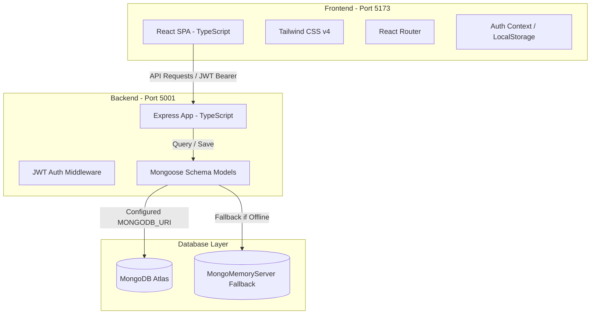

# Student Placement Tracker

A secure, full-stack, responsive Student Placement Tracker web application built using **React**, **TypeScript**, **Tailwind CSS v4**, **React Router**, **Node.js**, **Express**, and **MongoDB**. 

It allows students, recruiters, and placement coordinators to record, track, and update job application statuses (Applied, OA Scheduled, OA Completed, Interview, Offer, Rejected), view dynamic statistics, search, and filter placements instantly with zero configuration.

---

## Architecture Overview

The application follows a standard decoupled Client-Server architecture:



---

## Features

- **JWT Authentication**: User registration, login, session persistence via `localStorage`, and protected route guards.
- **Dynamic Dashboard Metrics**: Real-time aggregation of total applications, interviews, offers, and rejections.
- **CRUD Placements Management**: Full support for logging new applications, editing parameters (role, CTC, status, notes), and deleting entries.
- **Search & Advanced Filters**: Combine keyword searching (by company name or job role) with status filtering dynamically.
- **Resilient Database Fallback**: Automatically spins up an in-memory MongoDB database server (`MongoMemoryServer`) and pre-seeds it with demo accounts if local MongoDB or MongoDB Atlas credentials are not available.
- **Responsive Premium Design**: Sleek slate-mode aesthetics with vibrant indigo indicators, custom role badges, and clean feedback layouts.

---

## Tech Stack

### Frontend
- **Framework**: React 19 (TypeScript)
- **Styling**: Tailwind CSS v4 (using `@tailwindcss/vite` plugin)
- **Routing**: React Router DOM v7
- **Icons**: Lucide React

### Backend
- **Platform**: Node.js (TypeScript)
- **Web Framework**: Express.js
- **Database**: MongoDB Atlas / Mongoose ODM
- **Security**: JWT (`jsonwebtoken`), Password Hashing (`bcryptjs`), CORS
- **Dev Tooling**: `ts-node-dev` (automatic reload watcher), `typescript` compiler

---

## API Endpoints

All endpoints below (except Registration and Login) require a header parameter of `Authorization: Bearer <JWT_TOKEN>`.

| Method | Endpoint | Access | Description |
| :--- | :--- | :--- | :--- |
| **POST** | `/api/auth/register` | Public | Register a new user (role: student, recruiter, or admin) |
| **POST** | `/api/auth/login` | Public | Authenticate credentials and get a JWT token |
| **GET** | `/api/auth/me` | Protected | Fetch the profile details of the logged-in user |
| **POST** | `/api/applications` | Protected | Log a new job placement application |
| **GET** | `/api/applications` | Protected | Retrieve all applications belonging to the logged-in user |
| **GET** | `/api/applications/:id` | Protected | Fetch details of a single application (with ownership check) |
| **PUT** | `/api/applications/:id` | Protected | Update parameters of a specific application (with ownership check) |
| **DELETE** | `/api/applications/:id` | Protected | Remove an application from the tracker (with ownership check) |

---

## Environment Variables

Create a `.env` file in the `backend/` directory to configure the ports and databases:

```env
PORT=5001
MONGODB_URI=mongodb+srv://<username>:<password>@cluster0.xxxx.mongodb.net/placement_tracker?retryWrites=true&w=majority
JWT_SECRET=supersecretkey1234567890jwtsecret
```

> [!NOTE]
> If `MONGODB_URI` is omitted or points to an inactive local port, the backend will automatically spin up an in-memory database and seed it with demo records for zero-config previewing.

---

## Getting Started

### 1. Clone & Set Up Directory
Ensure you have [Node.js](https://nodejs.org/) installed on your machine.

### 2. Configure and Run Backend
```bash
cd backend
npm install
npm run dev
```
The server starts on `http://localhost:5001`.

### 3. Configure and Run Frontend
Open a new terminal session:
```bash
cd frontend
npm install
npm run dev
```
The Vite development server starts on `http://localhost:5173`. Access the tracker in your browser.

---

## Testing Out of the Box (Demo Data)

To make previewing instant, the database is auto-seeded with sample records when launching in-memory. You can log in immediately with:

- **Demo Email**: `demo@university.edu`
- **Demo Password**: `password123`

To seed an external database (Atlas/Local MongoDB) via CLI, configure the `MONGODB_URI` in `backend/.env` and execute:
```bash
cd backend
npm run seed
```

---

## Screenshots Section

*Placeholder for visual application screens:*

#### 1. Registration Screen
A clean card form validating passwords, name lengths, and emails with role selection (Student, Recruiter, Admin).

#### 2. Authentication Login Screen
Clean glassmorphic dark-theme container prompting credentials with live validation and error banners.

#### 3. Student Placement Dashboard
Dynamic statistics panels counting active applications, offers, and rejections alongside search fields, status filters, and the placement calendars.
