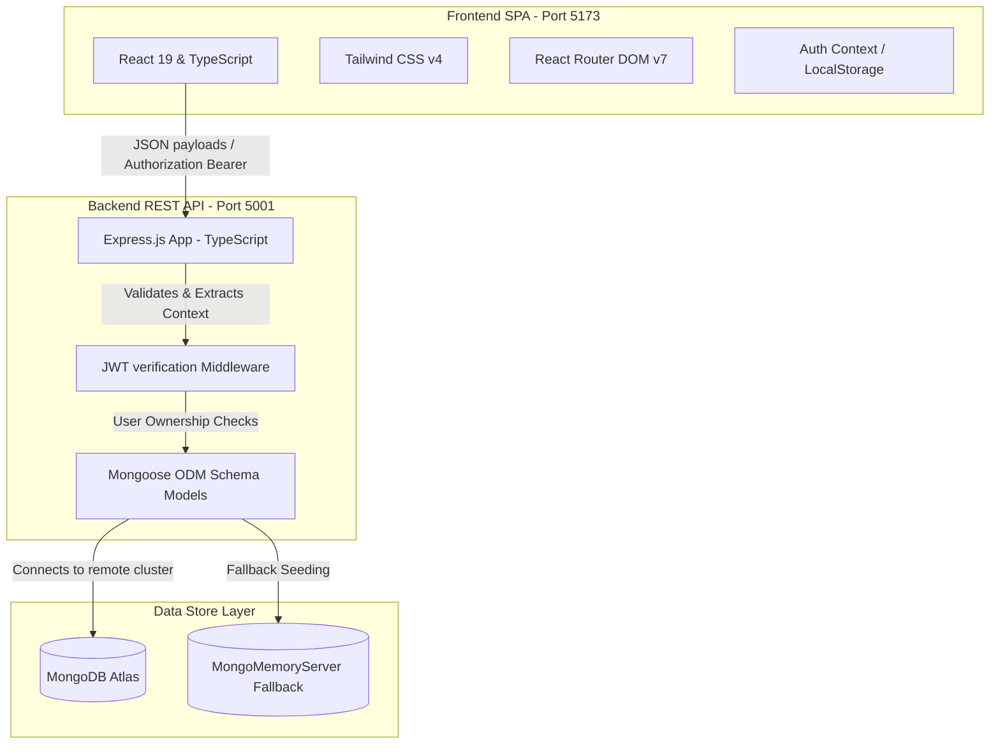

# Student Placement Tracker (Full-Stack Engineering Showcase)

A full-stack, secure, production-ready Student Placement Tracker designed to demonstrate modern web engineering patterns, security practices, and clean code principles. This project showcases capability in building modular architectures using **React (TypeScript)**, **Tailwind CSS v4**, **Node.js (Express)**, and **MongoDB (Mongoose)**.

---

## 🚀 Recruiter & Technical Interviewer Quick Summary

This repository is built to showcase standard software engineering practices required for enterprise full-stack development:

1. **Strict Type Safety**: TypeScript is implemented end-to-end (both backend and frontend) with strict compilation flags to eliminate runtime type issues.
2. **User Data Isolation & Security**: Authenticated routes verify JWT Bearer tokens. All database queries check ownership constraints (`req.user._id`) to prevent cross-tenant data leaks or unauthorized resource modifications (validated via automated 403 Forbidden checks).
3. **Database Resiliency (Reviewer-First UX)**: If remote MongoDB Atlas or local MongoDB service is offline, the backend automatically spins up an in-memory database (`MongoMemoryServer`) and pre-seeds it with demo accounts. This ensures that evaluators can run the project locally with **zero configuration**.
4. **Clean Code & Lint Compliance**: The codebase compiles cleanly under ESLint and strict compiler parameters, containing zero dead code or unused dependencies.

---

## 📐 System Architecture

The project follows a decoupled client-server architecture with state isolation:



---

## 🛠️ Tech Stack & Key Concepts

### Backend (API Server)
- **Node.js & Express.js**: Built with TypeScript, structured with clear separation of routes, models, middlewares, and controllers.
- **MongoDB & Mongoose**: Utilizes schema indexes, unique keys, relational reference queries, and pre-save hooks (for password hashing using `bcryptjs`).
- **JSON Web Tokens (JWT)**: Secure stateless sessions with a 30-day expiration window.

### Frontend (User Interface)
- **React (Vite)**: Standard hooks (`useState`, `useEffect`, `useCallback`) are combined with React Context API to manage user sessions and state.
- **Tailwind CSS v4**: Built using the official `@tailwindcss/vite` plugin, importing styling variables directly into CSS without legacy JS config files.
- **Lucide React**: Clean vector iconography representing application states, calendars, and action buttons.

---

## 🔒 Security & Data Isolation Details

All placement applications are tied to the creator's user ID. Below is an overview of how user boundaries are enforced at the API controller layer:

- **Verification Hook**:
  Before any modification or delete operation is performed, the controller queries the object and validates ownership:
  ```typescript
  if (application.userId.toString() !== req.user._id.toString()) {
    return res.status(403).json({ message: 'Not authorized to modify this application' });
  }
  ```
- **Read Isolation**:
  Retrieval queries filter directly by the active user context: `Application.find({ userId: req.user._id })`, ensuring a user never leaks private job logs to other logged-in students.

---

## 📋 RESTful API Endpoint Specifications

All paths under `/api/applications` require passing a valid JWT token via the `Authorization: Bearer <token>` header.

| Method | Route Path | Access | Data Validation / Logic |
| :--- | :--- | :--- | :--- |
| **POST** | `/api/auth/register` | Public | Validates email format, registers name, email, password (hashed), and sets role (`student`, `recruiter`, or `admin`). |
| **POST** | `/api/auth/login` | Public | Compares credentials using `bcrypt` and returns user profile details with a JWT token. |
| **GET** | `/api/auth/me` | Protected | Retrieves current user metadata from token context. |
| **POST** | `/api/applications` | Protected | Creates a placement application (company name, role, CTC package, date, and status). |
| **GET** | `/api/applications` | Protected | Fetches all job logs belonging to the user. |
| **GET** | `/api/applications/:id` | Protected | Fetches a single log after confirming database ownership. |
| **PUT** | `/api/applications/:id` | Protected | Updates fields (with status enum check) after checking user ownership. |
| **DELETE** | `/api/applications/:id` | Protected | Deletes the record after checking user ownership. |

---

## 📦 Environment Configurations

A configuration template is situated at `backend/.env`:

```env
PORT=5001
MONGODB_URI=mongodb+srv://<username>:<password>@cluster0.xxxx.mongodb.net/placement_tracker?retryWrites=true&w=majority
JWT_SECRET=supersecretkey1234567890jwtsecret
```

*Note: If local MongoDB or MongoDB Atlas URIs are not configured, the backend automatically transitions to an in-memory database and auto-seeds it with demo values.*

---

## 🚀 Local Deployment and Demo Preview

To test the application locally without creating accounts:

### 1. Initialize and Start Backend
```bash
cd backend
npm install
npm run dev
```
The server will boot on `http://localhost:5001` and output logs verifying that it has connected to the database.

### 2. Initialize and Start Frontend
In a separate terminal panel:
```bash
cd frontend
npm install
npm run dev
```
The UI loads on `http://localhost:5173`.

### 3. Log In with Demo Credentials
Because the database auto-seeds on connection fallbacks, you can test the system immediately with:
- **Email**: `demo@university.edu`
- **Password**: `password123`

To populate your custom MongoDB database with this sample set via CLI, configure your environment variables and execute:
```bash
cd backend
npm run seed
```
